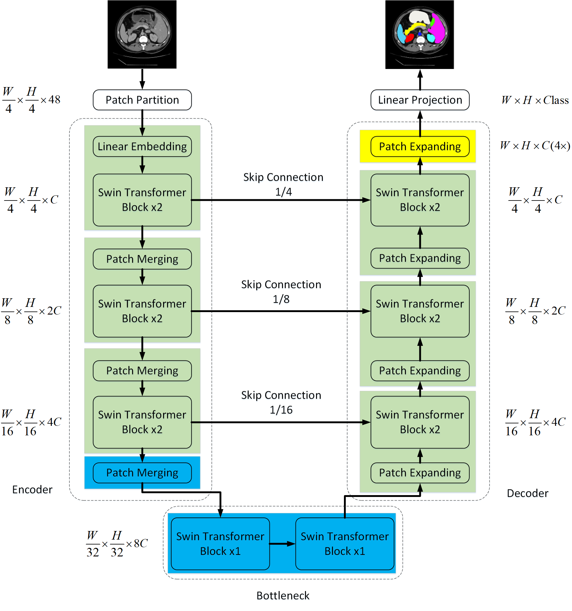

# Swin-Unet：基于纯Transformer的U型网络医学图像分割方法复现

---

## 摘要

**目的**  针对医学图像分割任务中传统U-Net架构受限于卷积神经网络局部感受野的问题，研究并复现一种基于纯Transformer架构的U型分割网络——Swin-Unet。**方法**  采用Swin Transformer作为编码器和解码器的基础模块，构建U型对称网络结构。编码器通过分块嵌入和逐层下采样提取多尺度特征，解码器通过分块扩张和跳跃连接逐步恢复空间分辨率。使用Swin-Tiny在ImageNet-22k上的预训练权重初始化编码器与解码器参数，在Synapse多器官CT数据集上进行微调训练。损失函数采用交叉熵损失与Dice损失的加权组合（权重0.4:0.6），优化器使用带动量的随机梯度下降，学习率采用多项式衰减策略。**结果**  在Synapse数据集12个测试体上，完整150轮训练后取得平均Dice分数0.761、HD95距离26.93 mm的分割精度。其中肝脏（DSC 0.929）、脾脏（DSC 0.876）等大器官分割精度较高，胰腺（DSC 0.541）、胆囊（DSC 0.611）等小器官仍具挑战性。**结论**  验证了纯Transformer架构在医学图像分割任务上的可行性。跳跃连接和镜像预训练初始化策略对模型收敛至关重要。受限于GPU显存（仅8 GB，批大小为12），结果略低于原论文（DSC 0.791），增大批大小和更长训练有望进一步提升性能。

**关键词：** 医学图像分割；Swin Transformer；U-Net；多器官CT；深度学习

---

## 1 引言

医学图像分割是计算机辅助诊断系统中的核心任务之一，旨在从CT、MRI等医学影像中自动识别和勾画器官或病变区域，为临床定量分析、手术规划和治疗评估提供依据。传统的分割方法依赖手工设计的特征（如边缘检测、区域生长、图割等），泛化能力有限且耗时。近年来，基于深度学习的方法，特别是卷积神经网络（CNN），显著提升了分割精度。

U-Net[1] 作为医学图像分割领域的里程碑工作，通过编码器-解码器结构和跳跃连接实现了多尺度特征融合，成为后续大量工作的基础架构。然而，CNN固有的局部感受野限制使其难以有效建模全局上下文和长距离依赖关系。为克服这一局限，研究者们尝试将具有全局建模能力的Transformer引入医学图像分割。

TransUNet[2] 率先将Vision Transformer（ViT）与CNN结合，使用CNN提取低层特征后由ViT建模全局依赖，取得了优于纯CNN方法的分割精度。但TransUNet的编码器仍依赖CNN提取初始特征，并非纯粹的Transformer架构。Swin Transformer[3] 通过分层结构和窗口注意力机制，在保持线性计算复杂度的同时实现了多尺度特征提取，为构建纯Transformer的密集预测网络提供了可能。

Cao等人提出的Swin-Unet[4] 首次将Swin Transformer完整应用于U型分割网络，编码器和解码器均采用Swin Transformer模块，实现了纯Transformer的医学图像分割。本文对该工作进行复现，详细介绍模型架构、训练策略和实验分析，并基于实验结果讨论关键因素对分割性能的影响。

## 2 方法

### 2.1 网络架构

Swin-Unet的整体架构如图1所示，由编码器、瓶颈层、解码器和跳跃连接四部分组成。

**编码器**采用Swin Transformer的分层结构。输入图像首先经过分块嵌入层（Patch Embedding），将224×224像素的图像划分为4×4大小的非重叠分块，投影到96维嵌入空间。随后通过4个编码阶段，每阶段包含偶数个Swin Transformer Block和1个分块合并层（Patch Merging），逐步将特征图分辨率从56×56降至7×7，通道数从96增至768。

**瓶颈层**由2个连续的Swin Transformer Block构成，在最小分辨率（7×7）上学习深度语义特征。

**解码器**采用与编码器对称的结构，包含4个解码阶段。每阶段首先通过分块扩张层（Patch Expanding）将特征图分辨率加倍、通道数减半，随后通过Swin Transformer Block进行特征细化。解码器最终输出7×7×768的特征，经过4倍上采样和线性投影层生成与输入等分辨率的分割预测图（224×224×*C*，*C*为类别数）。

**跳跃连接**将编码器各阶段的输出与解码器对应阶段的输入在通道维度拼接，使解码器能够融合多尺度特征和细节信息。

Swin Transformer Block的核心是移位窗口多头自注意力（Shifted Window Multi-head Self-Attention, SW-MSA），通过固定大小的窗口内注意力计算和相邻窗口间的信息交互，在保持线性计算复杂度的同时实现有效的全局上下文建模。

### 2.2 损失函数

训练采用交叉熵损失与Dice损失的加权组合：

*L* = 0.4 · *L*CE + 0.6 · *L*Dice（公式1）

其中交叉熵损失 *L*CE 衡量预测概率分布与真实标签的逐像素差异，Dice损失 *L*Dice 直接优化预测与真实标签之间的重叠系数，两者互补，兼顾全局分类精度和区域重叠度。

### 2.3 训练策略

**预训练初始化：** 使用Swin-Tiny在ImageNet-22k上的预训练权重初始化整个网络。编码器各层权重直接加载对应层的预训练参数，解码器各层采用镜像映射策略——将编码器第 *i* 层的预训练权重加载到解码器对应分辨率的第（3-*i*）层。该策略使解码器获得与编码器相同的高质量初始化，加速收敛。

**优化器与学习率：** 使用带动量的随机梯度下降（SGD），动量系数0.9，权重衰减1×10⁻⁴。初始学习率设为0.05，采用多项式衰减策略：

*η*(*t*) = *η*₀ × (1 - *t* / *T*)0.9（公式2）

学习率随批次大小线性缩放：当批大小不为24时，*η*₀ = 0.05 × (*B* / 24)。本实验批大小为12，实际初始学习率为0.025。

**数据增强：** 训练时对每个切片以50%概率随机执行旋转90°的倍数、水平或垂直翻转、±20°随机旋转，并将所有切片缩放至224×224统一尺寸。

## 3 实验结果与分析

### 3.1 实验设置

**数据集：** 使用Synapse多器官CT数据集[2]，包含30个腹部CT扫描体，共2211个轴向切片用于训练，12个体数据用于测试。标注包含8个腹部器官（主动脉、胆囊、左肾、右肾、肝脏、胰腺、脾脏、胃）及背景，共9类。

**硬件环境：** NVIDIA GeForce RTX 4060 Laptop GPU（8 GB显存），批大小设为12（原论文为24），每轮训练约170秒（约1.9 it/s），150轮总训练时间约7小时。

**评估指标：** 采用Dice相似系数（DSC）和95% Hausdorff距离（HD95）作为评价指标。DSC衡量分割区域与真实标注的重叠程度（越高越好），HD95衡量分割边界与真实边界的最大距离（越低越好）。

### 3.2 训练过程

模型在Synapse训练集上完成了150轮完整训练。图2展示了训练过程中的6条关键损失曲线。

**图2  Swin-Unet训练损失曲线（150轮）**

训练初期（第0轮），训练总损失为0.574（交叉熵0.215，Dice损失0.813），验证总损失为0.562（交叉熵0.127，Dice损失0.852）。损失在前20轮快速下降，之后进入平稳收敛阶段。

至第80轮，训练总损失降至0.111（交叉熵0.024，Dice损失0.169），验证损失降至0.299。训练结束时（第150轮），训练损失降至约0.066，验证损失稳定在0.137左右。训练损失与验证损失之间的差距随训练进行逐渐拉大，表明模型在训练集上出现了轻微的过拟合。验证Dice损失在第143轮达到最低点（0.217），验证总损失也在此轮达到最优（0.137），说明模型在后期仍在持续优化分割区域的重叠度。

### 3.3 分割结果

图3展示了模型在四个代表性测试体上的分割效果，每行包含原始CT切片、真实标注和模型预测的叠加可视化。

**图3  测试体分割结果对比（原始CT / 真实标注 / Swin-UNet预测）**

表1汇总了全部12个测试体的各器官Dice分数和HD95距离。

**表1  Swin-Unet在Synapse数据集上的分割结果（150轮训练）**

| 测试体 | 主动脉 DSC | 胆囊 DSC | 左肾 DSC | 右肾 DSC | 肝脏 DSC | 胰腺 DSC | 脾脏 DSC | 胃 DSC | 平均 DSC↑ | 平均 HD95↓ |
|:---|:---:|:---:|:---:|:---:|:---:|:---:|:---:|:---:|:---:|:---:|
| case0001 | 0.872 | 0.188 | 0.822 | 0.828 | 0.945 | 0.495 | 0.942 | 0.823 | 0.739 | 29.40 |
| case0002 | 0.835 | 0.653 | 0.930 | 0.895 | 0.943 | 0.534 | 0.929 | 0.801 | 0.815 | 9.06 |
| case0003 | 0.728 | 0.268 | 0.730 | 0.629 | 0.846 | 0.671 | 0.562 | 0.355 | 0.599 | 98.37 |
| case0004 | 0.796 | 0.228 | 0.928 | 0.746 | 0.914 | 0.404 | 0.880 | 0.530 | 0.678 | 31.66 |
| case0008 | 0.847 | 0.791 | 0.180 | 0.086 | 0.947 | 0.509 | 0.836 | 0.738 | 0.617 | 23.09 |
| case0022 | 0.872 | 0.772 | 0.928 | 0.934 | 0.940 | 0.643 | 0.942 | 0.901 | 0.866 | 5.81 |
| case0025 | 0.747 | 0.849 | 0.937 | 0.776 | 0.947 | 0.500 | 0.857 | 0.801 | 0.802 | 24.58 |
| case0029 | 0.891 | 0.606 | 0.628 | 0.568 | 0.949 | 0.495 | 0.908 | 0.806 | 0.731 | 55.03 |
| case0032 | 0.876 | 0.865 | 0.905 | 0.917 | 0.891 | 0.686 | 0.917 | 0.820 | 0.860 | 7.01 |
| case0035 | 0.792 | 1.000 | 0.892 | 0.891 | 0.943 | 0.424 | 0.923 | 0.742 | 0.826 | 5.40 |
| case0036 | 0.873 | 0.687 | 0.929 | 0.937 | 0.943 | 0.437 | 0.891 | 0.775 | 0.809 | 24.55 |
| case0038 | 0.821 | 0.424 | 0.907 | 0.920 | 0.944 | 0.690 | 0.918 | 0.693 | 0.790 | 9.22 |
| **平均** | **0.829** | **0.611** | **0.810** | **0.761** | **0.929** | **0.541** | **0.876** | **0.732** | **0.761** | **26.93** |

**图4  各器官Dice分数与HD95距离汇总（均值±标准差）**

### 3.4 结果分析

**大小器官分割精度差异显著：** 从表1和图4可见，肝脏（DSC 0.929）和脾脏（DSC 0.876）等体积较大的器官分割精度最高，而胰腺（DSC 0.541）和胆囊（DSC 0.611）等小器官分割精度较低。这与医学图像分割的普遍规律一致：小器官在CT切片中占据像素较少，类别不平衡明显，且边界模糊，分割难度显著更大。此外，部分测试体（case0008的左肾和右肾、case0003的胆囊）出现异常低值，可能与该测试体的解剖结构异常或标注质量有关。

**与论文结果的对比：** 表2列出了本复现与原论文的性能差异。

**表2  本复现与原论文结果的DSC对比**

| 器官 | 本复现 DSC | 原论文 DSC[4] | 差异 |
|:---|:---:|:---:|:---:|
| 主动脉 | 0.829 | 0.855 | -0.026 |
| 胆囊 | 0.611 | 0.665 | -0.054 |
| 左肾 | 0.810 | 0.838 | -0.028 |
| 右肾 | 0.761 | 0.796 | -0.035 |
| 肝脏 | 0.929 | 0.943 | -0.014 |
| 胰腺 | 0.541 | 0.566 | -0.025 |
| 脾脏 | 0.876 | 0.907 | -0.031 |
| 胃 | 0.732 | 0.766 | -0.034 |
| **平均** | **0.761** | **0.791** | **-0.030** |

本复现的平均DSC较原论文低约3个百分点。主要原因是：（1）批大小仅为12而非原论文的24，较小的批大小可能导致梯度估计噪声增大，影响收敛质量；（2）使用消费级RTX 4060笔记本GPU（8 GB显存）替代原论文的Tesla V100（32 GB），不同GPU类型的浮点运算精度差异可能影响训练结果，这在原论文的复现性说明中也有所提及。

**训练过程分析：** 从图2可见，验证损失在第143轮达到最优，后续训练中验证损失不再下降而训练损失继续降低，表明模型进入了过拟合阶段。适当引入早停策略或更强的数据增强有望缓解这一问题。

**预训练的重要性：** 实验观察到，加载ImageNet预训练权重后损失从0.574开始，训练曲线平滑下降，未出现剧烈震荡。这验证了原论文的结论——对纯Transformer模型进行充分预训练至关重要，且编码器和解码器均需要预训练初始化。

## 4 结论

本文对Swin-Unet——一种基于纯Swin Transformer的U型医学图像分割网络进行了完整复现。通过在Synapse多器官CT数据集上的150轮训练实验，得出以下结论：

（1）Swin-Unet将U-Net的编码器-解码器架构与Swin Transformer的分层注意力机制有效结合。在仅使用12的批大小和消费级GPU的条件下，取得了平均DSC 0.761、HD95 26.93 mm的分割结果，验证了纯Transformer架构在医学图像分割任务上的可行性。

（2）ImageNet预训练权重的镜像映射初始化对模型收敛至关重要。从训练曲线可见，模型从第0轮起即能稳定收敛，验证了该初始化策略的有效性。

（3）当前复现结果较原论文（DSC 0.791）低约3个百分点，主要受限于GPU显存导致的较小批大小。未来可通过使用更大显存的GPU、引入梯度累积技术、或采用混合精度训练等手段进一步提升性能。此外，适当降低模型容量或增强正则化有望缓解训练后期的过拟合现象。

本实验验证了纯Transformer架构在密集预测任务上的可行性和有效性，为后续研究提供了完整的、可复现的实现参考。

---

## 参考文献

[1] Ronneberger O, Fischer P, Brox T. U-Net: Convolutional networks for biomedical image segmentation[C]//International Conference on Medical Image Computing and Computer-Assisted Intervention. Cham: Springer, 2015: 234-241.

RONNEBERGER O, FISCHER P, BROX T. U-Net: Convolutional networks for biomedical image segmentation[C]//International Conference on Medical Image Computing and Computer-Assisted Intervention. Cham: Springer, 2015: 234-241.

[2] Chen J, Lu Y, Yu Q, et al. TransUNet: Transformers make strong encoders for medical image segmentation[J]. arXiv preprint arXiv:2102.04306, 2021.

CHEN J, LU Y, YU Q, et al. TransUNet: Transformers make strong encoders for medical image segmentation[J]. arXiv preprint arXiv:2102.04306, 2021.

[3] Liu Z, Lin Y, Cao Y, et al. Swin Transformer: Hierarchical vision transformer using shifted windows[C]//Proceedings of the IEEE/CVF International Conference on Computer Vision. 2021: 10012-10022.

LIU Z, LIN Y, CAO Y, et al. Swin Transformer: Hierarchical vision transformer using shifted windows[C]//Proceedings of the IEEE/CVF International Conference on Computer Vision. 2021: 10012-10022.

[4] Cao H, Wang Y, Chen J, et al. Swin-Unet: Unet-like pure transformer for medical image segmentation[C]//Proceedings of the European Conference on Computer Vision Workshops (ECCVW). Cham: Springer, 2022.

CAO H, WANG Y, CHEN J, et al. Swin-Unet: Unet-like pure transformer for medical image segmentation[C]//Proceedings of the European Conference on Computer Vision Workshops (ECCVW). Cham: Springer, 2022.

---

*附录A：复现代码见 code/ 文件夹（train.py, test.py, visualize_results.py, plot_training_curves.py 等）*

*附录B：实验输入数据见 data/ 文件夹*

*附录C：结果图高分辨率原图见 model_out/Synapse/result_figures/ 文件夹*
